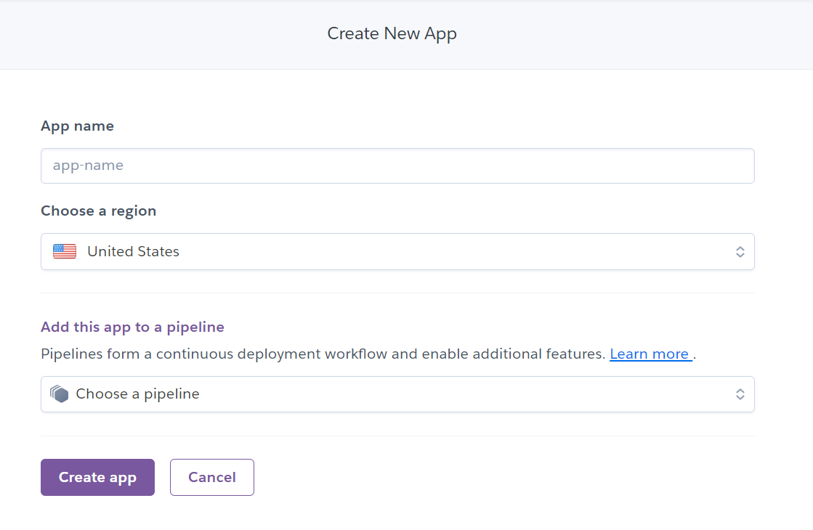

Linebot + Heroku Server Deployment
===

- targets: Making Linebot deploying on a Heroku server.
- backends: Django

Create New App on Heroku
---



#### What is Pipeline

A pipeline is a group of Heroku apps that share the same codebase. Each app in a pipeline represents one of the following stages in a continuous delivery workflow:

- Development
- Review
- Staging
- Production

Pipelines are extremely useful for managing multiple environments for your app. A common pipeline workflow has the following steps:

1. A developer creates a pull request to make a change to the codebase.
2. Heroku automatically creates a review app for the pull request, allowing developers to test the change.
3. When the change is ready, it’s merged into the codebase’s master branch.
4. The master branch is automatically deployed to the pipeline’s staging app for further testing.
5. When the change is ready, a developer promotes the staging app to production, making it available to the app’s end users.

Django Project Settings
---

1. Install `gunicorn`

    ```bash
    pip install gunicorn
    ```

2. Record all the required python dependencies in `requirements.txt`

    ```bash
    pip freeze > requirements.txt
    ```

3. Create a `Procfile` for the project
- NOTICE: **utf-8 encoding** is necessary for this file.

    ```bash
    echo "web: gunicorn {project_name}.wsgi" >> Procfile
    ```

4. Modify `setting.py` in the project

    ```python3
    STATIC_ROOT = os.path.join(BASE_DIR, 'static')
    ```

Deploy Django Project
---

1. Login Heroku

    ```bash
    heroku login
    ```

2. Deploy the project

    ```bash
    git init 
    git add .
    git commit -m "your_message"
    heroku git:remote -a {your_app_name}
    git push heroku main
    ```
